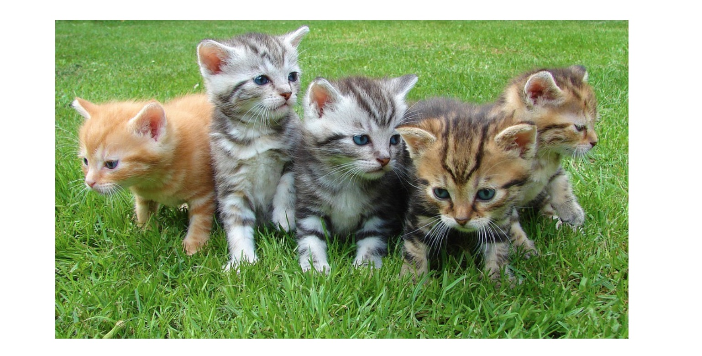
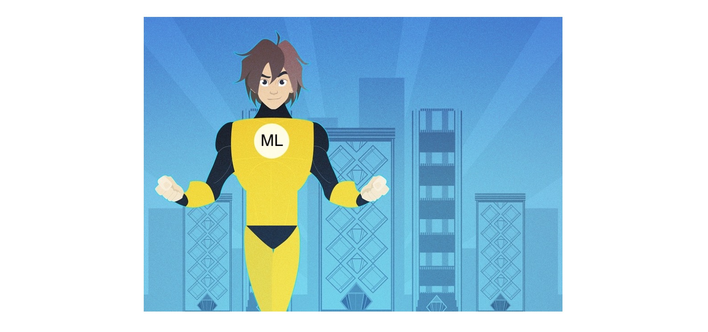
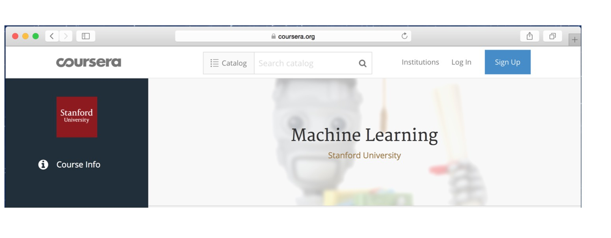
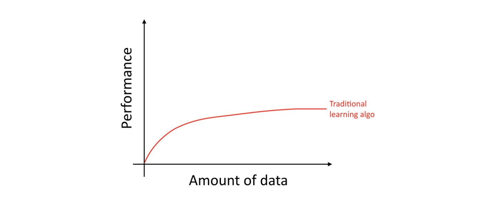
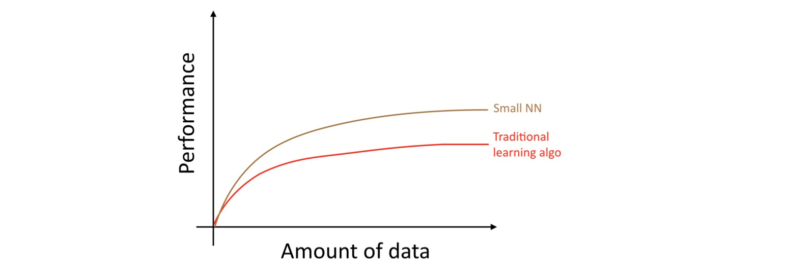
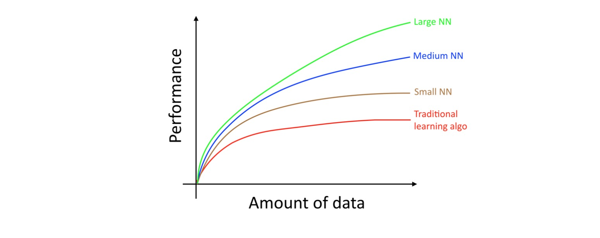
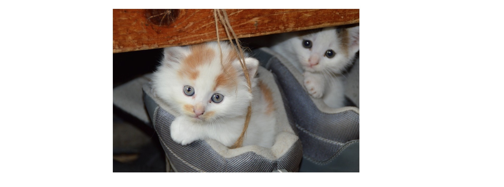

# Andrew Ng 机器学习新书

> 这周发布了前12章


# 目录（草案） 

1. [为什么机器学习策略](#1为什么机器学习策略)
2. [如何使用这本书来帮助你的团队](#2如何使用这本书来帮助你的团队)
3. [前提和标记](#3前提和标记)
4. [大规模驱动机器学习进程](#4大规模驱动机器学习进程)
5. [你的开发集和测试集](#5你的开发集和测试集)
6. [你的开发集和测试集应该来自相同分布](#6你的开发集和测试集应该来自相同分布)
7. [开发集/测试集需要多大](#7开发集测试集需要多大)
8. [为你的团队建立单数度量标准来进行优化](#8为你的团队建立单数度量标准来进行优化)
9. [优化和满足指标](#9优化和满足指标)
10. [有一个开发集和度量标准以加速迭代](#10有一个开发集和度量标准以加速迭代)
11. [何时更改开发集/测试集和度量标准](#11何时更改开发集测试集和度量标准)
12. [小贴士：设置开发集和测试集](#12小贴士设置开发集和测试集)


#1.为什么机器学习策略

机器学习是无数重要应用的基础，包括网络搜索，反垃圾邮件，语音识别，产品推荐等。 我假设 你或你的团队正在开发一个机器学习应用程序，并且你想要快速进步。这本书将帮助你这样做。

##示例：猫图片创业

假设你正在建立一个为猫爱好者提供无尽猫图片的创业公司。你使用神经网络建立一个计算机视觉系统来检测图片中的猫。  



但悲剧的是，你的学习算法的准确性还不够好。你处在极大的压力中，为了提高你的猫探测器。你会做什么呢？ 

你的团队有很多想法，例如：  
1. 获取更多的数据：收集更多的猫的照片。  
2. 收集更多样化的训练集。例如，猫在不寻常位置的图片；有着不寻常着色的猫；在各种相机设置下拍摄的图片; ...  
3. 通过运行更多的梯度下降迭代，训练算法更长。  
4. 尝试更大的神经网络，具有更多的图层/隐藏单位/参数。  
5. 尝试更小的神经网络。  
6. 尝试添加正则化（例如L2正则化）。  
7. 更改神经网络架构（激活功能，隐藏单位数等）。  
8. ...  

如果你选择这些可能的方向，你会建立领先的猫图片平台，并带领你的公司成功。如果你选择不好，你可能会浪费几个月。你会怎么进行呢？  

这本书会告诉你怎么做。大多数机器学习问题留下的线索告诉你什么是有用的尝试，什么是没有用的尝试。学会阅读这些线索会节省你几个月甚至几年的开发时间。  


#2.如何使用这本书来帮助你的团队

读完这本书后，你将会对一个机器学习项目，如何把握技术方向有深刻的理解。但是你的队友可能不明白你为什么要推荐一个特定的方向。也许你希望你的团队定义一个单一的评估指标，但他们不能被信服。你要如何说服他们？  

这就是为什么我把章节短：这样你就可以打印出来，并且让你的队友只读1到2页你需要他们知道的内容就足够了。  

优先级的一些变化会对你的团队的生产力产生巨大的影响。通过帮助你的团队有一些的变化，我希望你能成为你的团队的超级英雄！




#3.前提和标记

如果你已经上过机器学习的课程，如我的在 Coursera 机器学习 MOOC，或者如果你有应用监督学习的经验，你将能够理解这个本文。  

我假设你熟悉***监督学习*** ：学习一个从 x 映射到 y 的函数，使用被标记过的训练示例（x，y）。监督学习算法包括线性回归，逻辑回归和神经网络。虽然已经有很多机器学习的形式，但是今天大多数机器学习的实际价值是来自监督学习。  

我经常提到神经网络（也称为“深度学习”）。你只需要一个在这个文本中的基本了解。  

如果你不熟悉这里提到的概念，看看这个在 Coursera 上机器学习课程的前3周视频， 访问[http://ml-class.org](http://ml-class.org) 




#4.大规模驱动机器学习进程

深层学习的许多想法（神经网络）已经存在了几十年了。为什么是这些想法现在才起飞？  

最近进步的最大驱动因素有两个：  
1. 高可用数据。人们现在花更多的时间在数字设备（笔记本电脑，移动设备）上。他们的数字活动产生了大量的数据，我们可以把这些应用到我们的学习算法上。  
2. 大规模计算。我们几年前就能训练足够大的神经网络，即使利用如同今天那么庞大的数据集。

详细来说，即使你积累更多的数据，通常是老学习算法的表现，如逻辑回归，“停滞”。这意味着它的学习曲线“平坦”，并且即使你给它更多的数据，算法也会停止改进：  



这就好像旧算法不知道如何处理我们现在拥有的所有数据。  

如果你在同一个监督学习任务上训练一个小的神经网络（NN），你可能会获得略微更好的性能：  



在这里，“小NN”是指只有少量隐藏单位/层/参数的神经网络。最后，如果你训练越来越大的神经网络，你可以获得更好的性能：  



因此，你可以获得更好的表现，当你（i）训练一个非常大的神经网络时，你在上面的绿色曲线上；（ii）有大量的数据。  

许多其他细节，如神经网络架构也很重要，这里也有有很多创新。但是今天来改进算法性能的一个更可靠方法仍然是（i）训练更大的网络和（ii）获得更多的数据。  

如何完成（i）和（ii）的方法是惊人的复杂。这本书将讨论详细信息。我们将，从对传统算法和神经网络都有用的一般策略开始；直到为打造深度学习系统而建立最现代战略。 

> 此图表显示NN在小数据集中表现更好。这种效果不太一致，比NNs在大数据集中表现良好的效果。在小数据系统中，取决于关于如何手工设计的功能，传统的算法可能或可能不会做得更好。对于如果你有20个训练示例，那么是否使用逻辑回归或神经网络也许并不重要；特征的手工工程将具有比较大的效果相比于算法的选择。但如果你有100万的示例，我更支持神经网络。


# 配置开发集和测试集


#5.你的开发集和测试集

让我们回到我们早期的猫图片示例：你运行一个移动应用程序，用户正在上传许多不同的东西的图片到你的应用程序上。你想自动找到猫图片。  

你的团队从不同的网站下载猫的图片（正向示例）和不是猫的图片（反向示例）。他们将数据集的70％/ 30％分成训练集和测试集。使用这些数据，他们构建了一个对于这些训练集和测试集起到良好效果的猫检测器。  

但是当你将这个分类器部署到移动应用程序时，您会发现性能是真的很差！  


发生了什么？  

你弄明白了，用户上传的图片有不同于之前网站中构成你的训练集图片的外观：用户正在上传使用移动设备拍摄的图片，其趋向于较低的分辨率、模糊、不理想的照明度。自从你训练/测试集是由之前网站中的图像，您的算法没有足够一般化，对于你在意的智能手机里图像的实际分布。  

在现代大数据时代之前，这是机器学习中使用的常见规则，一个随机的70％/ 30％分成你的训练集和测试集。这种做法可以起到效果，但这是一个坏主意，对于越来越多的训练分布（也就是之前我们例子中的网站图片）不同于实际分布（也就是我们例子中的手机图片）的应用程序中。  

我们通常定义：  
1. 训练集 -- 使用它来运行你的学习算法。  
2. 开发集 -- 使用它来调整参数、选择特征、做出关于学习算法的其他决策。有时也被称为相应固定 交叉验证集。  
3. 测试集 -- 使用它来评估算法的性能，但不能做出关于学习算法或参数的任何决策。  

一旦你定义好了一个开发集和测试集，你的团队会尝试很多想法，比如不同的学习算法参数，看看什么效果最好。开发集和测试集让你的团队快速了解你的算法的效果。  

换句话说，开发集和测试集的目的是，为了打造机器学习系统，引导你的团队走向最重要的改变。  

所以，你应该做到： 选择开发集和测试集，以反映你期望在未来获得的数据，并希望做得好。  

换句话说，你的测试集不应该只是可用数据的30％，特别是如果你期望你的未来数据（移动应用程序图片）在性质上与您的训练集不同 （网站图像）。  

如果您尚未启动移动应用，则可能还没有任何用户，因此可能无法获得准确反映您必须在其中做好的数据 未来。但你可能仍然尝试近似这一点。例如，请你的朋友发送手机图片给你。一旦你的应用程式启动后，你就可以使用实际的用户数据来更新你的开发集/测试集。  

如果你在未来真的没有办法得到近似你期望得到的数据，也许你可以从使用网站图像开始。但你应该意识到导致系统不能很好地推广的风险。  

这就需要判断：决定投入多少去开发卓越的开发集和测试集。但不要假定你的训练分布与你的测试分布是一样的。尝试挑选测试，以反映你最终想要表现得很好的实例，而不是你碰巧拥有训练的任何数据。  


#6.你的开发集和测试集应该来自相同分布

您的应用程式图片资料会根据您的最大分割成四个区域市场：（i）美国，（ii）中国，（iii）印度，和（iv）其他。 想出一个开发套件和测试 设置，我们可以随机分配这两个段到dev集，另外两个到 测试集，对吧？ 说美国和印度在开发套; 中国和其他在测试集。  


一旦你定义了开发和测试集，你的团队将专注于改进开发集的性能。因此，开发集应该反映你想要改进的任务：应用于所有四个地理位置，而不只是两个。  

存在不同的开发集和测试集分布的第二个问题是：有可能你的团队会发生在开发集上起到好效果，而在测试集上起不到好效果的事。 我看到这以很多失望和浪费力气为结束。 避免这发生在你身上。  

例如，假设您的团队开发了一个在开发集上工作良好的系统，但不是测试集。如果你的开发和测试集来自相同的分布，那么你会的有一个非常明确的诊断，什么地方出错了：你已经过度配合​​开发集。明显治愈是获得更多的开发数据。但是如果开发集和测试集来自不同的分布，那么你的明确选项就少了。几个事情可能会出错：  
1. 你已经对于开发集过拟合了。
2. 测试集比开发集更难。 所以你的算法和预期做得一样，可能没有进一步的重大改进。  
3. 测试集不一定更难，但只是不同与开发集。所以在开发集上起到好效果，而在测试集上起不到好效果。在这种情况下，你做的提高开发集性能的很多工作是白费力气。  

在机器学习应用程序上工作已经够难了。具有不匹配的开发集和测试集引入了关于是否改进开发集分布的附加不确定性。具有不匹配的开发和测试集使得它更难找出什么起作用、什么不起作用，从而使得更难以确定工作的优先级。  

如果你正在处理第三方基准测试问题，他们的创建者可能已经指定开发集和来自不同分布的测试集。幸运的是，并不是技能，将有一个对这种基准的性能有更大的影响，相比于开发集和测试集来自相同的分布。这是一个重要的研究问题，学习算法在一个分布上训练并且很好地推广到另一个分布。但如果你的目标是在特定的机器学习应用程序上取得进展，而不是做研究进展，我建议尝试选择开发集和测试集来自相同的分布。这将使您的团队更有效率。  


#7.开发集/测试集需要多大

开发集应该足够大，以检测您正在尝试的算法之间的差异。例如，如果分类器A具有90.0％的准确度并且分类器B具有90.1％的准确度，那么一组测试集的100个示例是不能检测到这0.1％的区别。与我看到的其他机器学习问题相比，100个示例的开发集是很小的。开发集的大小从1,000到10,000的示例很常见。有10,000的示例，你将有很好的机会去检测到0.1％的提高。  

对于成熟和重要的应用程序，例如广告、网络搜索和产品推荐 -- 我也看到了很多积极的团队，甚至0.01％的提高，因为它直接影响公司的利润。在这种情况下，开发集可以确定远大于10,000，以便检测更小的改进。  

测试集的大小怎么确定呢？它应该足够大，以给予整个系统的性能很高的可信度。一个流行的启发式方法是使用30％的数据为你的测试集。但在大数据的时代，我们现在有机器学习的问题有时超过十亿的示例，分配给开发集/测试集的数据的分数已经萎缩，即使开发集/测试集中的绝对数量的示例已经增加了。没有必要有过多的超出需要评估算法的性能的开发集/测试集。 

> 在理论上，也可以测试算法的变化在开发集上是否具有统计学显着性差异。在实践中，大多数团队没有考虑这个（除非他们是出版学学术研究论文），我通常没有发现对测量临时进展有用的统计显着性测试。  


#8.为你的团队建立单数度量标准来进行优化

分类精度是一个单数的度量标准的例子 ：在运行你的分类器在开发集（或测试集），得到一个单一的数字，代表着被正确分类示例的分数。根据该度量，如果分类器A获得97％的精度，分类器B获得90％的精度，然后我们判断分类器A优越。  

相比之下，精确率和召回率不是单数度量标准：它给出两个用于评估分类器的数字。拥有多个数字评估指标更难以比较算法。假设你的算法性能如下： 


在这里，没有哪一个分类器明显优越，所以它不会立即指引你挑选一个。  

在开发周期里，你的团队将尝试关于算法架构、模型参数、特征选择等的很多想法。具有 单数的评价指标，如允许你根据其对此度量的性能对所有模型进行排序的准确率，并快速决定什么是最好的。  

如果你真的关心准确率和召回率，我建议使用一个标准的方法去把它们组合成一个数字。例如，可以取准确率和召回率的平均值，最终以单个数字。或者，您可以计算“F1值“，这是一种修改的计算其平均值的方法，并且比简单地取平均值更好。

> 猫分类器的准确率是开发集（或测试集）中标记为猫的图像真是猫的分数。它的召回率是所有猫图像在开发集（或测试集）中的标记为猫的分数。在具有高准确率和高召回率之间通常存在折衷。如果你想了解更多关于F1值的信息，看到 [https://en.wikipedia.org/wiki/F1_score](https://en.wikipedia.org/wiki/F1_score)。 它是精度率和召回率之间的“几何平均”，计算为2 /（（1 /精度率）+（1 /召回率））。


拥有单数度量标准可加快您正在大量的分类器中进行选择而作出决策的能力。它给出了在所有这些之中明确的偏好排名，因此是一个明确的进步方向。  

作为最后一个例子，假设你分别跟踪你的猫分类器在四个关键市场的准确性：（i）美国，（ii）中国，（iii）印度，和（iv）其他。给出四个指标。通过对这四个数字取平均值或加权平均值，最后得到单数度量。取平均值或加权平均值是最常见的一个将多个指标合并为一个的方法。


#9.优化和满足指标

这里有组合多个度量指标的另一种方法。  

假设你关心学习算法的准确性和运行时间。你需要从这三个分类器中选择： 


把准确率和运行时间放进一个单一的公式看起来是不寻常的，如：  

```
准确率 - 0.5 * 运行时间
```

这里是你可以做的替代：首先，定义什么是“可接受”的运行时间。让我们假设任何运行在100ms的东西都是可以接受的。然后，最大化准确性，针对你的分类器而言可满足的运行时间标准。在这里，运行时间是一个“满意度量” - 你的分类器只需要对这个指标“足够好”，有意义地来说，它应该采取最多100ms。精度是“优化度量”。  

如果你折衷N不同的标准，如二进制文件大小的模型（即对移动应用很重要，因为用户不想下载大型应用），运行时间， 和准确性，您可以考虑将N-1个条件设置为“满意”度量。你只需要他们满足一定的价值。然后将最后一个定义为“优化” 度量。 例如，为二进制文件大小和运行可接受的阈值，并且在给定这些约束的情况下尝试优化准确度。 

作为最后一个例子，假设你正在构建一个使用麦克风的硬件设备，监听用户说一个特定的“唤醒词”，然后使系统唤醒。例如，Amazon Echo 监听“ Alexa ” ；苹果 Siri 监听“嘿，Siri”；Android 监听“ Okay Google ”；百度监听“ Hello Baidu ”。你关心关于假阳性率 - 即使在什么时候系统没有人说唤醒词却被唤醒的频率；以及假阴性率 - 当有人说唤醒词却没有醒来。

以最小化假阴性率（优化度量），受到不超过每24小时一次假阳性（满意度量）。一旦你的团队对评估指标进行了优化，他们就能够做到 更快的进步。  


#10.有一个开发集和度量标准以加速迭代

很难事先知道什么方法最适合一个新问题。甚至经验丰富的机器学习研究人员通常会尝试许多数十个想法后，他们才发现一些令人满意的。在构建机器学习系统时，我会经常：  
1. 从关于如何构建系统的一些想法开始。
2. 贯彻执行编写代码。  
3. 进行了一项实验，它告诉我的想法有多好的效果。（通常我的前几个 想法没有好效果！）基于这些学习，回归到生成更多的想法，并继续迭代。 


这是一个迭代过程。 你可以越快越好，这个循环，你会做得越快地进展。 这就是为什么有开发集/测试集/和一个度量指标是重要的：每次你尝试想法，测量你的想法的性能开发集，让你快速决定是否 朝正确的方向前进。  

相反，假设您没有特定的开发集和度量。 所以每次你的团队开发一个新的猫分类器，你必须将它并入您的应用程序，并与应用程序运行几个小时，以了解是否新的分类器是一个改进。这将是 令人难以置信的慢！此外，如果您的团队将分类器的准确度从95.0％提高到95.1％，你可能无法通过使用应用程序检测到0.1％的改进。还有很多在你的系统将通过逐渐积累几十个这些0.1％的改进。有一个开发集和指标，你可以非常快速地检测哪些想法是成功地给你小（或大）的改进，因此让你快速决定什么想法不断完善，哪些丢弃。  


#11.何时更改开发集/测试集和度量标准

当开始一个新的项目，我试着快速选择开发集/测试集，因为这给团队定义明确的目标。  

我通常要求我的团队少于一个星期拿出一个初始的开发/测试集和初始度量 - 不再比这更长。它更好地拿出一些不完美的东西 快速前进，而不是过分考虑这一点。 但这一周的时间表不适用于 成熟的应用。 例如，反垃圾邮件是一个成熟的深度学习应用程序。 我有 看到的团队工作在已经成熟的系统花费几个月来获得更好的开发/ 测试集。  

如果以后你意识到你的初始开发/测试集或度量标准错过了标记，一切 快速更改它们。 例如，如果您的dev集+公制排名分类器A分类器 B，但是你的团队认为分类器B实际上对你的产品更好，那么这可能 是一个标志，你需要更改您的开发/测试集或您的评估指标。 dev set / metric有三个主要的可能原因错误地对分类器A赋值 更高：

1. 你需要做得很好的实际分布不同于dev /测试集。  

假设你的初始开发/测试集主要是成人猫的图片。 你运送你的猫应用程序， 并发现用户正在上传比预期更多的小猫图像。 所以，dev / test集 分布不代表实际分布，你需要做好。 在这里 case，更新dev /测试集更具代表性。
你已经过度适应开发套件了。 重复评估想法对开发集的过程导致您的算法逐步 



2. “过拟合”到开发集。  

当你完成开发，你将评估你的系统上 测试集。 如果你发现你的dev设置的性能比你的测试集更好 性能，这是一个迹象，你已经过度开发套件。 在这种情况下，得到一个新的dev集。 如果您需要跟踪团队的进度，您还可以定期评估您的系统 每周一次或每月一次 - 在测试集上。 但是不要使用测试集来做任何 关于算法的决定，包括是否回滚到前一周 系统。 如果这样做，您将开始过度拟合测试集，并且不能再依赖它 给出系统性能的完全无偏估计（如果你需要的话 您正在发表研究论文，或者使用这个指标来做重要的业务 决定）。  

3.度量衡量的是项目需要优化的内容。 假设对于您的cat应用程序，您的指标是分类精度。 此指标 目前将分类器A排在优于分类器B的位置。但是假设你试试两者 算法，并且发现分类器A允许偶尔的色情图像通过。 即使分类器A更准确，但偶尔会留下不良的印象 色情图像意味着其性能是不可接受的。 你是做什么？ 这里，度量标准未能识别算法B实际上优于的事实 您的产品的算法A. 因此，您不能再信任指标来选择最好的 算法。 现在是改变评估指标的时候了。 例如，您可以将度量标准更改为 严重惩罚让色情图像。 我强烈建议采摘 一项新指标，并使用新的指标来明确定义一个新的目标，为球队，而 比出发太久没有一个值得信赖的指标，并恢复到手动选择 分类之一。 这是很常见的一个项目中改变开发/测试集或评价指标。有一个 最初的开发/测试设置和指标可以帮助你快速迭代。如果你发现开发/测试台 或公制不再指向你的团队在正确的方向，这没什么大不了的！ 只是 改变他们，并确保你的团队知道的新的方向。

#12.小贴士：建立开发集和测试集

1. 从反映你希望得到什么数据的分布选择开发集和测试集。这可能来自不一样的训练数据的分布。  
2. 如果可能从相同的分布中选择开发集和测试集。  
3. 为你的团队选择单数度量指标进行优化。如果有多个是你关心的指标，考虑把他们合并到一个单一的公式里（例如平方误差指标），或者定义满意指标和优化指标。  
4. 机器学习是一个高度迭代的过程：你之前可能尝试了很多种想法才找到一个令你满意的。   
5. 建立开发集/测试集、单数度量指标可以帮助您快速评估算法的性能，因此迭代会更快。  
6. 当一个全新的应用起步时，在不到一周的时间里，尝试建立开发集/测试集和度量指标。对于成熟的应用程序，这可能需要更长的时间。   
7. 当你有大量的数据时，70％/30％的测试分布的传统启发式方法不适用于问题;开发集和测试集可以比数据的30％要低得多。  
8. 你的开发集应足够大，以检测对于你的算法精度产生的有意义的变化，但并不一定要大很多。你的测试集应该足够大，给你系统的最终性能一个有信心的估计。   
9. 如果说你的开发集和度量指标不再指引你的团队前往正确的方向，那就迅速改变它们：（i）如果你有过度拟合开发集，那就获得更多的开发集数据。（ⅱ）如果你关心的实际分布表明开发集/测试集的分布是不同的，那就获得新的开发集/测试集数据。（iii）如果你的指标不再度量对你而言重要的指标，那就改变度量指标。