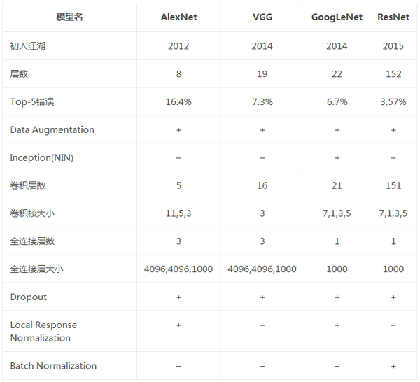

# deeplearningDemo

##Wunderlist

- [ ] 1. [Machine Learning Yearning](https://github.com/zhourunlai/deep-learning-demo/blob/master/MLyearning/README.md)

- [ ] 2. [Deep Learning Book](https://github.com/zhourunlai/deep-learning-demo/blob/master/DLbook/DeepLearningPapers.md)(感谢北京大学张志华团队的翻译工作，中文版点击[这里](https://github.com/exacity/deeplearningbook-chinese))


***

##一、记录深度学习例子：

| 名称 | 目录|
|:-----|-----|
| Caffe | [[dir]](https://github.com/zhourunlai/deeplearningDemo/tree/master/Caffe)|
| TensorFlow | [[dir]](https://github.com/zhourunlai/deeplearningDemo/tree/master/TensorFlow)|
| Theano | [[dir]](https://github.com/zhourunlai/deeplearningDemo/tree/master/Theano)|
| Keras | [[dir]](https://github.com/zhourunlai/deeplearningDemo/tree/master/Keras)|


***

##二、记录历程点滴:

1. 掌握机器学习相关的概念及计算公式，包括有/无/半监督学习，强化学习，分类/回归/标注，聚类；训练集/验证集，交叉验证，测试集；数据预处理，正则化，归一化；损失函数，经验风险最小化，结构风险最小化，最优化算法；训练误差，泛化误差，欠拟合，过拟合；准确率，召回率，F1值，ROC和AUC；

2. 掌握机器学习主流的模型及其[算法](https://github.com/zhourunlai/machine-learning-algorithm)，包括有生成方法：朴素贝叶斯、隐马尔可夫模型，判别方法：感知机、logistic回归、决策树、K近邻、支持向量机、提升方法、最大熵、条件随机场等；

3. 安装 numpy, scipy, pandas, matplotlib, scikit-learn, xgboost 等 python 包，[实战](https://github.com/zhourunlai/machine-learning-in-action)项目：识别手写数字、画决策树、文本挖掘过滤垃圾邮件、情感倾向分析、波斯顿房价预测、基于协同过滤的推荐系统、图像分类等，上手 kaggle、KDD 比赛题或者阿里天池、滴滴Di-Tech、今日头条bytecup 比赛题；

4. 了解大数据相关的知识，包括有Flume、Kafka，Storm，Hadoop，Spark等，知道Hadoop基金下的项目（Cassandra、HBase、Hive、Pig、ZooKeeper等）的应用场景，特别地要知道分布式计算框架的原理，从 HDFS、MapReducer 到 Streaming；

5. 安装 spark-2.0.0-bin-hadoop2.7，掌握 [Hadoop Shell命令](https://spark.apache.org/docs/latest/spark-standalone.html)，两种模式下运行 [Spark 作业](https://spark.apache.org/docs/latest/spark-standalone.html)，了解 Spark SQL/Streaming/GraphX，掌握 [Spark MLlib 写机器学习算法](http://spark.apache.org/mllib/)；

6. 深度学习相关的概念及计算公式，包括神经元模型、输入层、隐藏层、输出层、weight、bias、BP算法、目标函数（mean_squared_error、mean_absolute_percentage_error等）、激活函数（sigmoid、softmax、tanh、relu等）、优化算法（SGD、RMSprop、Adagrad、Adam等）、多层感知器、自动编码器、卷积神经网络CNN（卷积层Convolution2D、池化层MaxPooling2D）、递归神经网络RNN、LSTM、全连接网络等；

7. 安装深度学习框架 TensorFlow/Theano 或其它，掌握 tf 的张量、图、会话的用法，了解分布式/使用GPU的方法，动手写经典的项目，学会使用 Vgg 16/19 和 ResNet 的模型并运用到自己的项目中；

8. 安装更上层的[深度学习库 Keras](http://keras.io/)，更加快速、熟练的编写出各种种类的神经网络模型。


***

TODO:  

1. Autoencoder：  
    特点：1）数据相关的，2）有损的，3）从样本中自动学习的；    
    作用：1）数据去噪，2）进行可视化而降维；  
    类型：简单自编码器、稀疏自编码器、深度自编码器、卷积自编码器、序列到序列的自动编码器、变分自编码器；    
    
2. CNN：  
    LeNet、AlexNet、GoogLeNet、VGG、ResNet  

    高级激活: LeakyReLU, PReLU, ELU, ParametricSoftplus, ThresholdedReLU, SReLU  

    卷积: Convolution1D, Convolution2D, AtrousConvolution2D, SeparableConvolution2D, Deconvolution2D, Convolution3D, UpSampling1D, UpSampling2D, UpSampling3D, ZeroPadding1D, ZeroPadding2D, ZeroPadding3D  

    内核: Dense, Activation, Dropout, SpatialDropout2D, SpatialDropout3D, Flatten, Reshape, Permute, RepeatVector, Merge, Highway, MaxoutDense  

    嵌入: Embedding  

    归一化: BatchNormalization  

    池化: MaxPooling1D, MaxPooling2D, MaxPooling3D, AveragePooling1D, AveragePooling2D, AveragePooling3D, GlobalMaxPooling1D, GlobalAveragePooling1D, GlobalMaxPooling2D, GlobalAveragePooling2D  

    循环: SimpleRNN, LSTM, GRU  

    包装器:Bidirectional, TimeDistributed  

3. RNN：  
    [http://deeplearning.net/tutorial/rnnslu.html](http://deeplearning.net/tutorial/rnnslu.html)  

4. LSTM：  
    [http://deeplearning.net/tutorial/lstm.html](http://deeplearning.net/tutorial/lstm.html)  
    
5. GAN:  
    [http://datascienceassn.org/sites/default/files/Generative%20Adversarial%20Nets.pdf](http://datascienceassn.org/sites/default/files/Generative%20Adversarial%20Nets.pdf)  
    [https://github.com/255BITS/HyperGAN](https://github.com/255BITS/HyperGAN)




***

##三、记录开源资料：
###机器学习相关
#####网站：
1. [awesome-machine-learning](https://github.com/josephmisiti/awesome-machine-learning)
2. [dl](https://github.com/ty4z2008/Qix/blob/master/dl.md)
3. [我爱机器学习](https://www.52ml.net/star)
4. [寒小阳的博客](http://blog.csdn.net/han_xiaoyang?viewmode=contents)

#####[书籍](https://www.douban.com/people/100617219/)：
1. 统计学习方法、集体智慧编程、利用python进行数据分析、机器学习实战、机器学习西瓜书、Spark MLlib 机器学习
2. 自然语言处理、计算广告、推荐系统、计算机视觉、大数据应用实践

#####课程：
1. [Coursera Ng大牛的课程](https://www.coursera.org/learn/machine-learning)
2. [小象学院邹博老师的课程](http://www.chinahadoop.cn/classroom/23/courses)

###深度学习相关
#####网站：
1. [deeplearning.net](http://deeplearning.net/) 收藏夹必备，paper指南
2. [Neural Networks and Deep Learning](http://neuralnetworksanddeeplearning.com/index.html)
3. [UFLDL教程](http://deeplearning.stanford.edu/wiki/index.php/UFLDL%E6%95%99%E7%A8%8B)

#####书籍：
1. [DeepLearningBook](http://www.deeplearningbook.org/) 亚马逊预售12月出，等不及花40元打

#####课程：
1. [优达学城的deep-learning免费课程](https://cn.udacity.com/course/deep-learning--ud730)
2. [深度学习2016暑假课程有PPT无字幕](http://videolectures.net/deeplearning2016_montreal/)
3. [周莫烦的录制视频Youtebe和优酷均有](https://www.youtube.com/channel/UCdyjiB5H8Pu7aDTNVXTTpcg)


>Tips: 
①Follow 业界大牛的 [Twitter](https://twitter.com/ufozrl/following)，比如 Geoffrey Hinton (Google AI团队)、Aymeric Damien (Facebook AI实验室)、Yoshua Bengio (蒙特利尔大学终身教授) 、Andrew Ng (斯坦福大学副教授)、Li Feifei、Andrej Karpathy 等，掌握大神们的最新研究进展；
②Reddit 上订阅一些主题如 [/r/deeplearning](https://www.reddit.com/r/deeplearning/)，可以知道业界最新的新闻动态，还有一些 discussion 如 WAYR([what_are_you_reading](https://www.reddit.com/r/MachineLearning/comments/4qyjiq/machine_learning_wayr_what_are_you_reading_week_1/)) 可以交流。


***

##四、记录开发机

1. 自己的 **MacBook Pro** 一训练数据CPU升到200%~300~就开始发热，甚至风扇开始转；  

2. 偶然听朋友建议到 [**SuperVessel**](https://crl.ptopenlab.com:8800/dashboard/auth/login/?next=/dashboard/project/instances/)上试试，装了GPU下的TF，但是必须在规定的VPN下才能SSH；  

3. 接下来转到 [**AWS**](http://docs.aws.amazon.com/zh_cn/AWSEC2/latest/UserGuide/using_cluster_computing.html#gpu-instance-specifications)，可以自己搭建应用了， 现在有两种虚拟机 g2.2xlarge（单块CPU，4G显存）和 g2.8xlarge（4块CPU，4G显存），都是CUDA的。知乎上的教程[在AWS上配置深度学习主机](https://zhuanlan.zhihu.com/p/25066187)。

4. 阿里云HPC 和 Ucloud 现也有带 Tesla 的物理机了。用前者低配版的训练 [neural-style](https://github.com/anishathalye/neural-style)，14分钟左右，```python neural_style.py --content content.jpg --styles style.jpg --output output.jpg --iteration 1000 --width 512```。用之前算一算数据量要付费多少，大了的话买虚拟机还不如自己搭一台工作站；      

5. 等毕业了自己搭一台**工作站**吧... 

6. TPU是什么鬼


***

##五、记录集群部署

1. [Spark集群部署](https://zhuanlan.zhihu.com/p/23689558)  

2. [分布式tensorflow部署与训练](http://blog.xiaorun.me/index.php/archives/375/)  

使用 [git hook](https://dearb.me/archive/2015-03-30/automate-deploy-your-websites-with-git-hook/)，配合 [rsync](http://www.dahouduan.com/2014/11/19/rsync-daemon/)，本地开发机一次提交代码，使集群间指定目录代码一致，节省每台机器都复制粘贴代码的操作；这样跑分布式训练时，只需要在每台机器上带参数来运行代码就可以了


***

##六、项目demo

1. IMAGE相关：  
    1.1 图像风格转换neural-style [anishathalye/neural-style](https://github.com/anishathalye/neural-style)  
    1.2 素描自动上色 [pfnet/PaintsChainer](https://github.com/pfnet/PaintsChainer)  
    1.3 图像描述 [im2txt](https://github.com/iFighting/models/tree/master/im2txt)  
    1.4 图片生成故事 [neural-storyteller](https://github.com/ryankiros/neural-storyteller)  
    1.5 小度机器人  
    1.6 生成明星脸  

2. NLP相关：  
    2.1 古诗词生成器  

3. RNN相关：  
    3.1 创作歌曲/歌曲风格转换  

4. RL相关：  
    4.1 愤怒的小鸟 [yenchenlin/DeepLearningFlappyBird](https://github.com/yenchenlin/DeepLearningFlappyBird)  
    4.2 模拟自动驾驶 [upul/behavioral_cloning](https://github.com/upul/behavioral_cloning) [kevinhughes27/TensorKart](https://github.com/kevinhughes27/TensorKart)  


***

##七、调参trick

1. [Theano调试技巧](https://zhuanlan.zhihu.com/p/24857032)

